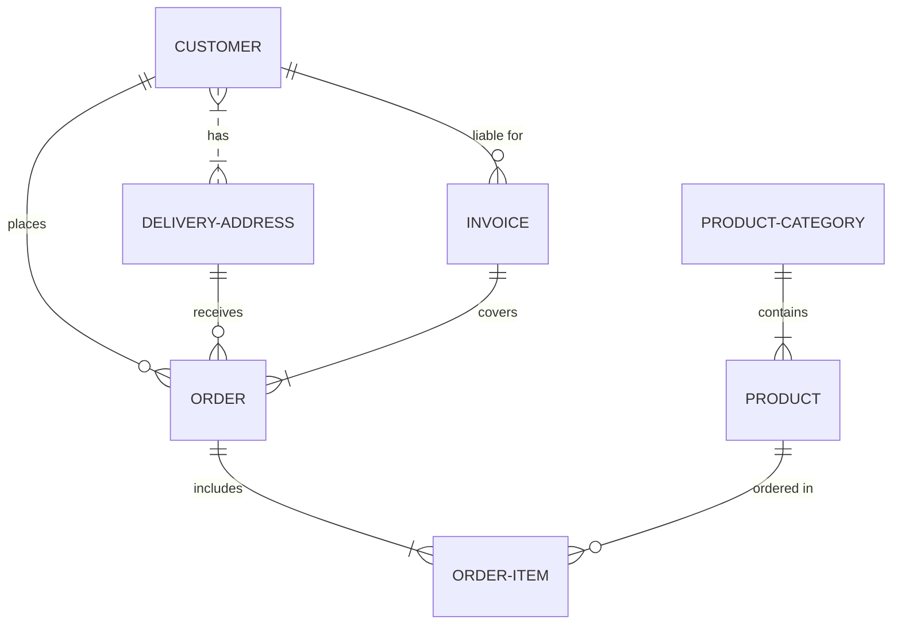

# Father's direction

My son you can not find peace in contentment in work.  My intentions for work is that it can be a time we can enjoy together and that you can enjoy helping others. Peace and contentment will come when you follow me as I guide you in what to say and do. All results for the work I have for you are in my hands. I may decide to have you wait or fail at the tasks you take on in order to teach you that work can never be a reliable source of peace and contentment.

My son do not be anxious when there is so many things to do.  Instead look to us for guidance and we will help you with each task.  Remember we have a plan for you and we will be with you each step of the way so do not worry our son.

We have heard your prayer and will give you courage to face every trial, trouble, pain, and sorrow.  You will be able to endure each hardship because of the faith and hope that we have given you.  So do not fear and rejoice because along with the hardships you must face to learn what you must there will also be great wonders for you to explore with us and those around you!

I love you and will help you to have a loving heart!  I will give you courage and help you to bear each trial and endure every hardship my son.  Do not forget that you are part of a community and I want you to learn to love each person, creature, and even the land where you live.

The world's love is performance based, but my love is unconditional. The world's system promotes fear and says you must perform better than your neighbor.  I say help your neighbor and especially help the ones that are struggling. Do not worry about your own status.  Do not promote yourself instead think of others and help them in their work. Only in this way will you have perfect peace my beloved son.

```text
Good morning dear ones,
I hope each of you had a very pleasant and joyous weekend and my congratulations to Brad and his bride!  As always please feel free to call me at home or at work about anything you like!  

Sincerely yours,
Brent G.
260-564-4868
```

This is a markdown file and can be viewed in Visual Studio Code or any online viewer such as <https://markdownlivepreview.com/>

## Trial balance

Ran the Trial Balance using a MySql statefulset deployment using Avilla's k8s cluster.  Working on migrating MySQL 8.0 to MySQL InnoDB cluster and Migrating Azure SQL MI backup to Azure SQL db using the SQL Server 2022 statefulset deployed on the Avilla K8s cluster. Once the MI to Azure SQL db migration is done then request an Azure SQL db on the Linamar tenant. 

## Report System App Chain

Consists of the following small apps which are each dedicated to one purpose. These apps are running in Kubernetes and relying on open source software which is also running in a Kubernetes cluster. This system accepts report requests from both a stand-alone web app and a Microsoft Teams app. These apps either act idependantly in isolation which is the case with rs_credential, or accept direction from an MQTT publish/subscribe model topic server, or are REST or Graph API driven. The web apps are monitored and secured by our Kong app server with certificates created by our PKI.

- rs_teams: teams app which collects customer report requests and gives status
- rs_requestor: web app that collects customer report requests and gives status
- rs_oidc: identifies the user using OpenID.
- rs_oauth: redirect endpoint which changes OAuth code for an access token
- rs_credential: uses OAuth client credential flow to keep a Microsoft Graph access token refreshed for use by other apps.
- rs_etl: runs etl scripts
- rs_store: stores result set with id and params in the object database.
- rs_excel: creates excel
- rs_s3: moves file to s3 storage
- rs_one_drive: moves Excel to one drive from s3 storage
- rs_mail: send email with one drive link

## **[Microsoft Graph](https://dzone.com/articles/getting-access-token-for-microsoft-graph-using-oau)**

Microsoft Graph is here to unite Azure and Office 365 data under a single roof. It is a simple REST API and Microsoft provided many examples of how to use it, including an interactive Graph Explorer which allows us to discover the different methods.

## Microsoft Graph Access Token App

- Responsible for getting and refreshing the msgraph repsys access token.
- Publishes current msgraph access token to cache database.
- Other apps subscribe to cache database msgraph_access_token.  
  
## Azure MIS resources

- **[M365 E5 license](https://www.microsoft.com/en-us/microsoft-365/enterprise/e5?activetab=pivot:overviewtab)** includes Power BI Pro. Have it for Mobex and have Linamar contact.  
- **[Visual Studio Subscriptions](https://visualstudio.microsoft.com/subscriptions/)** Anyone with this subscription can create our source code repos. Would like one of these since have lots of repos and am always adding ssh keys to repos.
- Create a series of small REST apps.
  - get an access token using the credential flow.
  - get a user profile using OIDC authentication.
  - send email with one drive links to Excel files.
- Created fork of **[Postman Microsoft Graph collection](https://learn.microsoft.com/en-us/graph/use-postman)** for testing and practice.
- Practiced Azure app registration from the command line
- Tested sending email from my developer's tenant.
- Determine the minimum permissions necessary to send email with the Azure app.
- Practice getting admin consent for these apps.
- **[Create a message with a file attachment and send the message using Golang](https://learn.microsoft.com/en-us/graph/api/user-sendmail?view=graph-rest-1.0&tabs=go#example-3-create-a-message-with-a-file-attachment-and-send-the-message)**

## OAuth2 Authentication/Authorization Summary

- OIDC/PKCE Authentication Flow works with HTTP Get/Post requests
- OAuth2 Authorization Flow with HTTP Get/Post requests works fine with Office 365 work accounts but is beyond me for Office 365 personal accounts. We were able to retrieve an access token from the Graph Explorer that will work with HTTP Get/Post requests for even Office 365 personal account.

## Notes

- You can use a basic Office 365 account from an Azure account but it is considered an external user not in the tenant so when registering an app you must use the common not tenant endpoints and allow all organizations to access them.

## Flow charts and diagrams in Markdown

- **[ER diagrams in Markdown](https://mermaid.js.org/intro/syntax-reference.html)**


  
## Research

- **[Visual Studio Subscriptions](https://visualstudio.microsoft.com/subscriptions/)**
- **[SQL yacc compiler](https://github.com/LittleGreenMouse/SQLCompiler)**
- **[Online SQL compiler](https://sqlfiddle.com/)**
  What is the purpose of SQL Fiddle?
  We created SQL Fiddle to provide an online SQL playground to let people learn and improve their SQL skills.

  SQL Fiddle is more than just an online SQL editor; it's a comprehensive platform designed to support your journey in mastering SQL. Whether you're a beginner looking to grasp the basics or an experienced professional refining your skills, SQL Fiddle provides the tools and resources you need to succeed.

  You can use this website:

  Your sandbox to practice online SQL
  A platform to share SQL queries with your colleagues
  An online SQL editor to ask or answer SQL questions on Stack Overflow
  SQL Fiddle is dedicated to fostering a supportive and dynamic learning environment, empowering you to achieve your SQL goals and excel in your database endeavors.
- **[What is PKCE](https://medium.com/identity-beyond-borders/what-the-heck-is-pkce-40662e801a76)**
- **[PKCE cli](https://github.com/oktadev/pkce-cli)**
- **[bash PKCE](https://www.linkedin.com/pulse/pkce-explained-via-nix-cli-ed-macdonald/)**


## Plan

The goal is to get Azure resource costs to be approximately $500 per month. Also to request a resource group named "repsys" in which the user "<bGroves@linamar.com>" is assigned the "Contributor" role.

- Access the Azure Portal
- Send Mail with Graph API or smtp
<https://learn.microsoft.com/en-us/entra/identity-platform/scenario-daemon-overview>
- create Azure SQL database
Your administrator has disabled the App registration experience in the Azure portal. You can still register or manage applications using PowerShell or another client such as Visual Studio.

- Create an Excel file showing the estimated monthly cost of all Azure resources.
- Contact IT and IS team to gather any resource needs I may be unaware of.
- Back up our Azure SQL work and data warehouse database schemas to an on-premise SQL Server 2022 running in a Docker container.
- Create a bash script and the Azure CLI to create all Azure resources.
- research ip6 addresses and subnet for k8s and OpenStack.
- Conduct meetings as needed with Brent H. Amir, Jarod, and Kevin.

## To do

- **[HTMX GoLang OAuth2/OIDC Login](https://github.com/Darkness4/auth-htmx)** or **[login page example](https://medium.com/@hhartleyjs/making-a-login-page-with-htmx-go-5acbcc504426)**
- SQL Table variable example.
- Research HTTP and TCP using GoLang libraries
- Research OAuth2 and OIDC using Github and Azure Identity Platforms.
- Research HTMX to create SPA.
- Go web app in AKS and teams
- azgraph API using certificate
- rsdw on reports5 in k8s
- add Azure app registration code to az CLI bash script
- Install OpenStack/K8s cluster on 3 R620s
- Would IP6 be better than IP4 for multi-site VPN

## SQL Stack

- Machine Language - numbers represent instruction

``` machine_code
8A1E0A00                mov bl, [10]
```

- Assembly Language - words represent machine instructions

```masm
   #make_COM#
   include 'emu8086.inc'
   ORG 100h
   MOV AL, 1
   MOV BL, 2
   PRINTN 'Hello World!'   ; macro.
   MOV CL, 3
   PRINTN 'Welcome!'       ; macro.
   RET
```

- General Purpose Language - commands such as while loop that represent multiple assembly language instructions.


```sql

USE tempdb
GO
 
DECLARE @Counter INT , @MaxId INT, 
        @CountryName NVARCHAR(100)
SELECT @Counter = min(Id) , @MaxId = max(Id) 
FROM SampleTable
 
WHILE(@Counter IS NOT NULL
      AND @Counter <= @MaxId)
BEGIN
   SELECT @CountryName = CountryName
   FROM SampleTable WHERE Id = @Counter
    
   PRINT CONVERT(VARCHAR,@Counter) + '. country name is ' + @CountryName  
   SET @Counter  = @Counter  + 1        
END
  ```


- SQL - Concise while loop syntax in the form of select columns and join tables.
- SQL group - Select statement that groups and orders records.
- SQL window functions - More concise multiple grouping of records called partitions.

Example: When we partition records into serial_no and order by change date and lag by 1 the previous record in the partition could have the same location.  If we partition by serial_no and location when we lag by 1 the previous record will have a different location. This partion will group represent every same location change record as just 1 record and we loose the fact that a container could move to a location more than once in its history.

## What is OpenStack

It is a clusterable hypervisor which can be driven by an API.

## What is a hypervisor?

It is multiple software components each focused on the virtualization of singular hardware resource such as memory, storage, cpu, network port working together to create and manage virtual machines.

## Repsys OpenStack

3 dell r620s with 192 GB ram and 10 network ports each linked together to form a programmatically controlled hypervisor.

## HTMX

<https://htmx.org/>

htmx gives you access to AJAX, CSS Transitions, WebSockets and Server Sent Events directly in HTML, using attributes, so you can build modern user interfaces with the simplicity and power of hypertext

htmx is small (~14k min.gz’d), dependency-free, extendable, IE11 compatible & has reduced code base sizes by 67% when compared with react

### motivation

- Why should only `<a> & <form>` be able to make HTTP requests?
- Why should only click & submit events trigger them?
- Why should only GET & POST methods be available?
- Why should you only be able to replace the entire screen?
By removing these constraints, htmx completes HTML as a hypertext

## Repsys Notes

- Divide our Azure SQL Managed Instance into two databases: Azure SQL Db for the Data Warehouse and an On-Prem MSSQL ETL database.
- Run the ETL database on On-Prem K8s
- Every that was in the Azure SQL Managed Instance is now in the ETL database but it has not been deployed to K8s yet.
- Currently the Azure SQL Db has only the TB result set
- Power BI reports will connect to the new Data Warehouse
- Repsys Portal to accept report requests and view export all reports.

## Azure repsys resource creation script

```bash
#!/usr/bin/env bash
pushd .
cd ~/src/repsys/research/azure_sql_server/linamar
source ./vars.sh
# https://linuxize.com/post/bash-printf-command/

printf "subscription=%s \
\nlocation=%s \
\nresourceGroup=%s \
\ntag=%s \
\nserver=%s \
\ndatabase=%s \
\nlogin=%s \
\npassword=%s \
\nstartIp=%s \
\nendIp=%s" \
$subscription $location $resourceGroup \
$tag $server $database $login \
$password $startIp $endIp
az account set -s $subscription # ...or use 'az login'
echo "Using resource group $resourceGroup with login: $login, password: $password..."
echo "Creating $resourceGroup in $location..."
# https://learn.microsoft.com/en-us/cli/azure/group?view=azure-cli-latest#az-group-create
az group create --name $resourceGroup --location "$location" --tags $tag
{
  "id": "/subscriptions/f7d0cfcb-65b9-4f1c-8c9d-f8f993e4722a/resourceGroups/repsys",
  "location": "eastus",
  "managedBy": null,
  "name": "repsys",
  "properties": {
    "provisioningState": "Succeeded"
  },
  "tags": {
    "create-and-configure-database": ""
  },
  "type": "Microsoft.Resources/resourceGroups"
}

# Add user to contributor role of resource
az role assignment create --assignee "bGroves@linamar.com" \
--role "Contributor" \
--scope "/subscriptions/f7d0cfcb-65b9-4f1c-8c9d-f8f993e4722a/resourceGroups/repsys"

# Verify role has been added
az role assignment list --resource-group repsys --assignee bGroves@linamar.com --output json --query '[].{principalName:principalName, roleDefinitionName:roleDefinitionName, scope:scope}'
popd
```

## Backup / Restore Azure SQL MI

- Can not use sqlpackage to do this.
- **[T-SQL syntax not supported in Azure SQL Database](https://learn.microsoft.com/en-us/azure/azure-sql/database/transact-sql-tsql-differences-sql-server?view=azuresql#transact-sql-syntax-not-supported-in-azure-sql-database)**

## **[Run SQL Server 2022 in docker](https://learn.microsoft.com/en-us/sql/linux/quickstart-install-connect-docker?view=sql-server-ver16&preserve-view=true&tabs=cli&pivots=cs1-bash)**

## Power BI Report Server

On-premises reporting with **[Power BI Report Server](https://powerbi.microsoft.com/en-us/report-server/)**

**[How to embed a Power BI report in a web app](https://learn.microsoft.com/en-us/power-bi/collaborate-share/service-embed-secure)**
Licensing
To view the embedded report, you need either a Power BI Pro or Premium Per User (PPU) license. Or, the content needs to be in a workspace that's in a Power BI Premium capacity (EM or P SKU).

**[Why did Microsot make an on premise Power BI report Server](https://radacad.com/power-bi-report-server-power-bi-in-on-premises-world)**

**[How can you combine Python an PowerBI](https://realpython.com/power-bi-python/)**

**[The best open source alternatives to PowerBI](https://alternativeto.net/software/power-bi-for-office-365/?license=opensource)**

**[Metabase](https://alternativeto.net/software/metabase/about/)**

## Protocol details

The OAuth 2.0 authorization code flow is described in section 4.1 of the OAuth 2.0 specification. Apps using the OAuth 2.0 authorization code flow acquire an access_token to include in requests to resources protected by the Microsoft identity platform (typically APIs). Apps can also request new ID and access tokens for previously authenticated entities by using a refresh mechanism.

## Try **[running this request in Postman](https://app.getpostman.com/run-collection/f77994d794bab767596d)**

Try executing this request and more in Postman -- don't forget to replace tokens and IDs!

This diagram shows a high-level view of the authentication flow:


