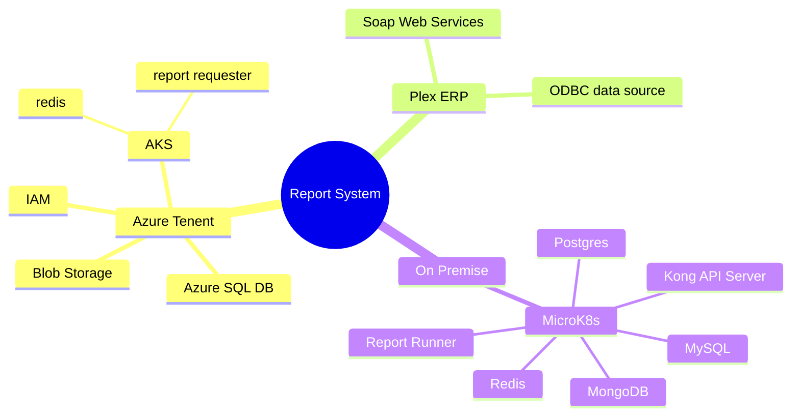
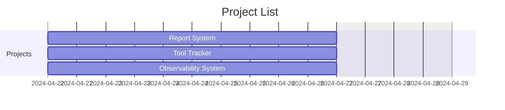
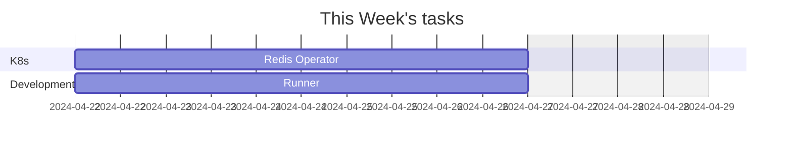
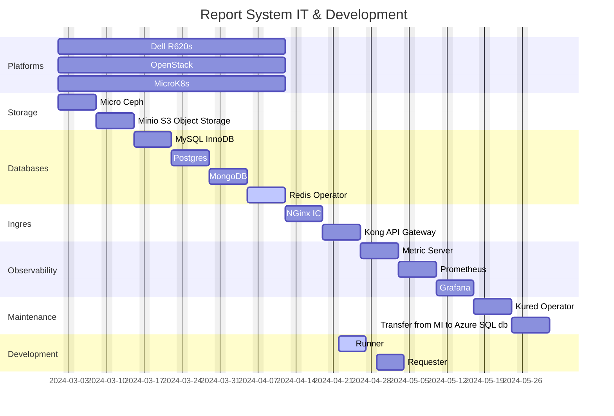
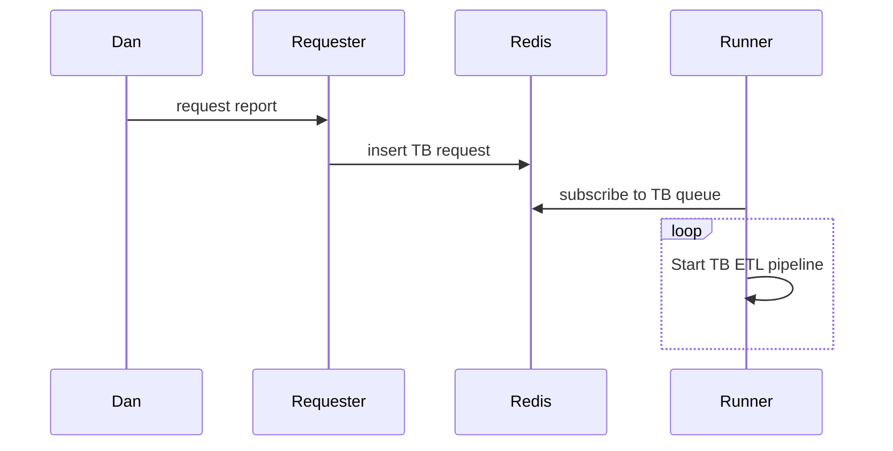
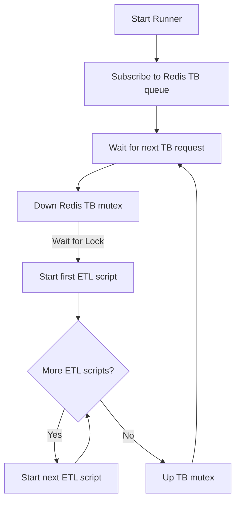

# Father's direction

My son you can not find peace and contentment in work.  My intentions for work is that it can be a time we can enjoy together helping others. Peace and contentment will come when you follow me as I guide you in what to say and do. All results of your work are in my hands. I may decide to have you wait or fail at the tasks I have planned for you.  The work I give you is meant to teach you that work can never be a reliable source of peace and contentment. The only reliable source of these wonderful things is doing what is right by following me.

Follow us my son and you will have peace and joy.  We will experience the many wonders of creation together. We love you and you are never alone because we will always be with you to guide and direct you our beloved son!

My son do not be anxious when there is so many things to do.  Instead look to us for guidance and we will help you with each task.  Remember we have a plan for you and we will be with you each step of the way so do not worry our son.

We have heard your prayer and will give you courage to face every trial, trouble, pain, and sorrow.  You will be able to endure each hardship because of the faith and hope that we have given you.  So do not fear and rejoice because along with the hardships you must face to learn what you must there will also be great wonders for you to explore with us and those around you!

I love you and will help you to have a loving heart!  I will give you courage and help you to bear each trial and endure every hardship my son.  Do not forget that you are part of a community and I want you to learn to love each person, creature, and even the land where you live.

The world's love is performance based, but my love is unconditional. The world's system promotes fear and says you must perform better than your neighbor.  I say help your neighbor and especially help the ones that are struggling. Do not worry about your own status.  Do not promote yourself instead think of others and help them in their work. Only in this way will you have perfect peace my beloved son.

```text
Good morning dear ones,
I hope all is going well for you and your loved ones :-)  As always please feel free to call me at home or at work about anything you like!  

Sincerely yours,
Brent G.
260-564-4868
```

## **[Link to view this Markdown document](https://github.com/brentgroves/status/blob/main/2024/week18.md)**

You will get an "unable to render error" just press the "<-->" button above mermaid diagram.

## Best ways to create and view Markdown with Mermaid

- **[Markdown Mermaid extension](https://marketplace.visualstudio.com/items?itemName=bierner.markdown-mermaid)**
- **[JebBrains IDE](https://www.jetbrains.com/guide/go/tips/mermaid-js-support-in-markdown/)**

]

**[Click link to edit mindmap](https://mermaid.live/edit#pako:eNqFUk1v4kAM_SvWnEDKooRE-ZgblB4qipollSqtcpkmhh0tM04nk1Up4r_vkDSUPfVm-9nPzx8nVlGNjDMlda1EU2oAQ2Qnky02ZCwUx9aimk4vAMDiozMIz6hR2yEC8LDYjOYAFz8fYbUcY5zLivRkJ2AnfrwS_ZmOyPJAr1BYMmKPV4Z1MZpOCNayvXV7RQbfOnSizIDkB3yH-23-fb-CRAMv6Hqi-SsrvFI_rZZ3UAsroKXOVE7MgDxpyA0q2V7lbWRlaJ3eiFqT3sMif-hJR0196tHt4cvNqbV7gzeVG1dJX3sC2P4_7ucBtp3WF17mMYVGCVm7a50uaSWzv1Fhybgza9yJ7mBLVuqzSxWdpeKoK8at6dBjXePmw5UUeyMU4ztxaK_R-1q6I4yZjdC_iNSNy_iJvTMeZ7MwnEeJn4TJPAhjjx0ZD6L5LMviJPL9KM7S2E_PHvvo6_1Z6qfzMEmywI-DyA8ij2HfajO8XP95538_hrzz)**









## Run TB Report



## Trial Balance Runner



## Ticketing System Help

Rejection occurred because bar code engraver not working for a long period of time and management was unaware of the issue.

Issue: CNC operators are expected to keep asking and calling management if important issues are not getting resolved.
Suggestion: Allow the CNC operators to enter priority issues that could lead to a rejection.
Question: What would be the best way for a CNC operator to inform management of critical issues.

- call Jake
- maintenance ticketing system
- plex suggestion system
- it ticketing system

## Repsys Operator

Make a k8s operator to install and monitor repsys.

## Plex ODBC

We did have to log into this ODBC account periodically do we still have to "mg.odbcalbion" if so how?
