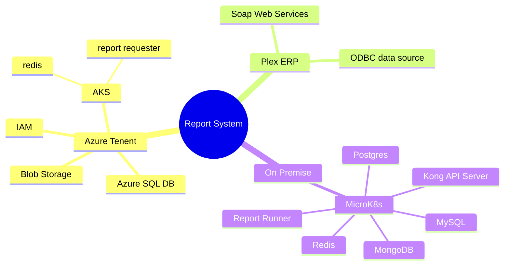
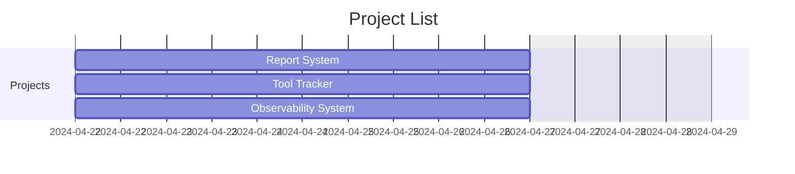
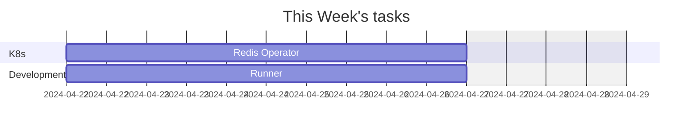
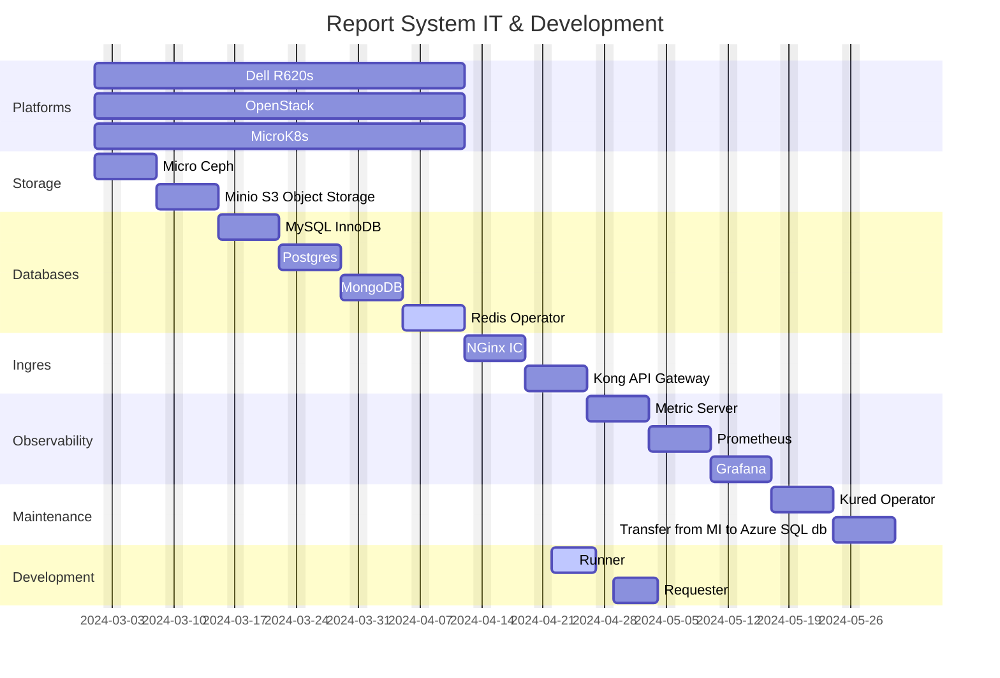
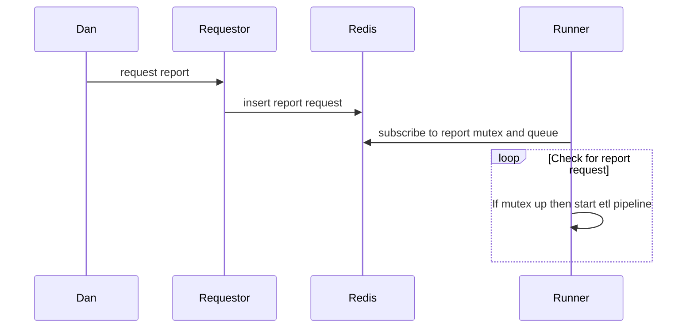
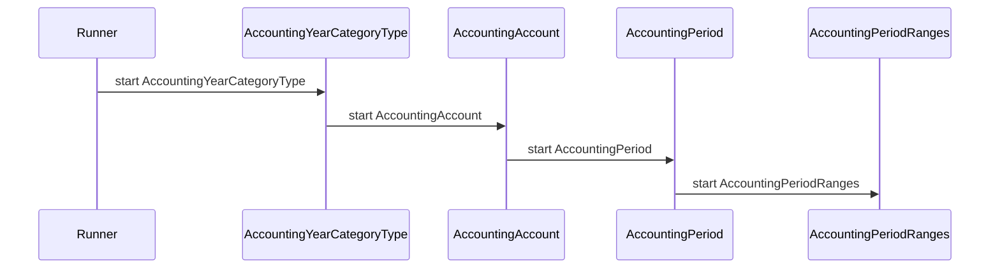
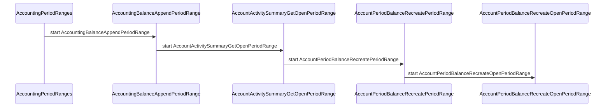

# Father's direction

My son you can not find peace and contentment in work.  My intentions for work is that it can be a time we can enjoy together helping others. Peace and contentment will come when you follow me as I guide you in what to say and do. All results of your work are in my hands. I may decide to have you wait or fail at the tasks I have planned for you.  The work I give you is meant to teach you that work can never be a reliable source of peace and contentment. The only reliable source of these wonderful things is doing what is right by following me.

Follow us my son and you will have peace and joy.  We will experience the many wonders of creation together. We love you and you are never alone because we will always be with you to guide and direct you our beloved son!

My son do not be anxious when there is so many things to do.  Instead look to us for guidance and we will help you with each task.  Remember we have a plan for you and we will be with you each step of the way so do not worry our son.

We have heard your prayer and will give you courage to face every trial, trouble, pain, and sorrow.  You will be able to endure each hardship because of the faith and hope that we have given you.  So do not fear and rejoice because along with the hardships you must face to learn what you must there will also be great wonders for you to explore with us and those around you!

I love you and will help you to have a loving heart!  I will give you courage and help you to bear each trial and endure every hardship my son.  Do not forget that you are part of a community and I want you to learn to love each person, creature, and even the land where you live.

The world's love is performance based, but my love is unconditional. The world's system promotes fear and says you must perform better than your neighbor.  I say help your neighbor and especially help the ones that are struggling. Do not worry about your own status.  Do not promote yourself instead think of others and help them in their work. Only in this way will you have perfect peace my beloved son.

```text
Good morning dear ones,
I hope all is going well for you and your loved ones :-)  As always please feel free to call me at home or at work about anything you like!  

Sincerely yours,
Brent G.
260-564-4868
```

## Ways to view Mermaid in Markdown

- **[markdown mermaid extension](https://marketplace.visualstudio.com/items?itemName=bierner.markdown-mermaid)** or use the
- **[JebBrains IDE](https://www.jetbrains.com/guide/go/tips/mermaid-js-support-in-markdown/)**

<https://www.mermaidchart.com/raw/58bee69e-cc6c-400f-989c-17682692d7a8?theme=light&version=v0.1&format=svg>

[](https://mermaid.live/edit#pako:eNpdUk1vnEAM_SvWnHYluoUFwYKqSknbW6NETXqpuEzAwKiMPZ2PqGS1_73sB2mSOdnvPdtPHu9Fwy2KSmhFrZamJgDL7FerC7BeHyGAW6t6Re6cAHxn6mFQzrOdFqyqVMO06iR08sMj8-_1wtyxCaO0ykmvmBYU4Noqr9wA5syDcVMz8Mj9BDL4gS08ME1wHZ7lpeoHOpS2GZYetwTYddh49YSEzn16tB8_S2qhQ-mDRfdKeBU869lBA43Fd05-uv_S8_ty0jwheGwGUn_Ce8G9t9JjP7czoyRS1L_lr2wfNJKHeYvmhX1gHl8a3SHB0ayRBu0C3qDVUrUiEvoSVWJ_JGvhB9RYi2oOW-xkGH0tajrM0nldfD9RIypvA0YimHY291XJ3kr9FvzWqvnXFsxI-sWsX6Wi2ou_osrLTZpusyIu0mKbpHkkJlEl2XZTlnmRxXGWl7s83h0i8Xyqjze7eLdNi6JM4jzJ4iSLBJ5G3Zwv7HRoh38PlMI5)









# Trial Balance Pipeline



## Pipeline Runner



## Runner Continuation



## Ticketing System Help

Rejection occurred because bar code engraver not working for a long period of time and management was unaware of the issue.

Issue: CNC operators are expected to keep asking and calling management if important issues are not getting resolved.
Suggestion: Allow the CNC operators to enter priority issues that could lead to a rejection.
Question: What would be the best way for a CNC operator to inform management of critical issues.

- call Jake
- maintenance ticketing system
- plex suggestion system
- it ticketing system

## Trial Balance Pipeline Runner

The ETL pipeline is a set of Go routines (threads) each of which is responsible for 1 ETL script. The TB runner's main thread begins the ETL pipeline by sending a message the first ETL script go routine.  Each ETL script go routine completes and then calls the next ETL script's go routine.  The final ETL script finishes and then sets the TB mutex up so that the runner's main thread can start the pipeline again.

```psuedo_code
create go routines (threads) and communitcation channels for each tb etl script in tb etl pipeline
subscribe to redis tb mutex and request queue 

infinite while loop
    if tb queue not empty
        remove request from queue
        when tb mutex up
            down tb mutex 
            send request to 1st ETL script's go routine
        end
    end
```

## Trial Balance ETL script go routine

Each ETL script's go routine either waits for a message from the runner's main thread in the case of the first ETL script's go routine or the previous ETL scripts go routine before it starts. If it completes successfully it sends a message to the next ETL script's go routine or in the case of the final ETL script's go routine inserts a record in the redis result list indicating it's completion status.

```psuedo_code
infinite while loop
    if redis 
    runner's main thread calls 1st ETL scripts go routine.
    while more ETL scripts to run
        if ETL script complete successfully
            call the next ETL script's go routine
        else
            update redis result list to failed
            send error message via email
        end
    end
    last ETL script's go routine sets redis TB mutex up and inserts a record in the redis TB result list indicating it's completion status.
end
```

## Repsys Operator

Make a go k8s operator to install and monitor repsys.

## Plex ODBC

We did have to log into this ODBC account periodically do we still have to "mg.odbcalbion" if so how?

## Report services request summary

Reduce our Azure data warehouse costs from $748 to $30 per month by using an Azure SQL db service-hosted database instead of one hosted on an Azure SQL MI. Keep the Azure Kubernetes service as is at $290 per month.

## **[Azure SQL MI](https://azure.microsoft.com/en-us/pricing/details/azure-sql-managed-instance/single/)**

Currently, this Azure SQL MI hosts an Azure SQL database which is being used as our data warehouse.

```yaml
SQL managed instance: mgsqlmi
databases: mgdw,ssisdb
resource group: rg-useast-dataservices
cost: $748/month
plan: Migrate schema and import data into our Azure SQL db then delete this instance.
status: This is being used to generate our Southfield's Plex Trial Balance report. In the future, our report system's Microsoft Teams accessible request/viewer/archive apps would use this.
```

## **[Azure SQL db](https://azure.microsoft.com/en-us/pricing/details/azure-sql-database/single/)**

```yaml
server: repsys
database: rsdw
resource group: repsys
type: Standard S1: 20 DTUs
cost: $30/month
plan: Use this instead of Azure SQL MI.
status: This service is running but the database schema and data have not been transferred from the database stored on the mgsqlmi MI.
```

## Azure AKS (Kubernetes)

The plan is to run the minimal components of the report system from this 1-node K8s Cluster.  It is needed because Power BI reports and supporting apps running in Microsoft Teams tabs need to be accessible through an SSL-secured public IP.

```yaml
resource: reports-aks
resource group: reports-aks
Node pools: 1 node pool
cost: $290/month
status: This service is running but the request/viewer/archive apps are not ready yet.
```

## **[Setup Redis Enterprise on Kubernetes](https://redis.io/docs/latest/operate/kubernetes/architecture/)**

Used to communicate between the repsys requestor and pipeline components.

**[Redis game server usage](https://news.ycombinator.com/item?id=2705613)**


## Network-attached persistent storage

Kubernetes and cloud-native environments require that storage volumes be network-attached to the compute instances, to guarantee data durability. Otherwise, if using local storage, data may be lost in a Pod failure event. See the figure below:


On the left-hand side (marked #1), Redis Enterprise uses local ephemeral storage for durability. When a Pod fails, Kubernetes launches another Pod as a replacement, but this Pod comes up with empty local ephemeral storage, and the data from the original Pod is now lost.

On the right-hand side of the figure (marked #2), Redis Enterprise uses network-attached storage for data durability. In this case, when a Pod fails, Kubernetes launches another Pod and automatically connects it to the storage device used by the failed Pod. Redis Enterprise then instructs the Redis Enterprise database instance/s running on the newly created node to load the data from the network-attached storage, which guarantees a durable setup.

Redis Enterprise is not only great as an in-memory database but also extremely efficient in the way it uses persistent storage, even when the user chooses to configure Redis Enterprise to write every change to the disk. Compared to a disk-based database that requires multiple interactions (in most cases) with a storage device for every read or write operation, Redis Enterprise uses a single IOPS, in most cases, for a write operation and zero IOPS for a read operation. As a result, significant performance improvements are seen in typical Kubernetes environments, as illustrated in the figures below:


## Microsoft 365 E5 Plan

Need E5 or E3 plan to get needed add-ons.
Price per user/month (annual commitment) $57.00

## Add-ons Available for Microsoft 365 E3 and E5 subscriptions

- Power Automate (need this). Enables users to automate repetitive tasks and workflows. Available as an add-on for Microsoft 365 E3 and E5.
- Power BI Pro (need this). Provides advanced data visualization and business intelligence features. Available as an add-on for Microsoft 365 E3 and E5.

## Azure services

- Azure SQL db (need this) - Power Automate used to copy data from Plex to DW.  All that we need with a much lower cost than Azure SQL MI.  
- Azure AKS (Kubernetes) (need this) - Hosts Microsoft teams accessible report request web app.

## Azure DevOps

Azure Repos (need this)
Get unlimited, cloud-hosted private Git repos and collaborate to build better code with pull requests and advanced file management.

Azure pipelines (nice to have)
Build, test, and deploy with CI/CD that works with any language, platform, and cloud. Connect to GitHub or any other Git provider and deploy continuously.
