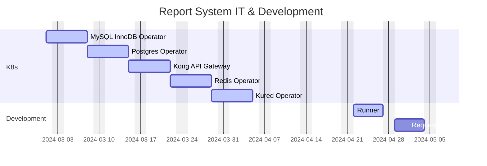

# Report System Status

This is a work in progress.  When finished we will have a Microsoft Teams tab accessible way to request, view, and archive both parameterized reports requiring long running SQL scripts and those requiring live Plex data. It will also be able to use the **[Azure Graph API](https://learn.microsoft.com/en-us/graph/overview)** to email excel files or about anything else having to do with any Microsoft apps.

## references

https://mermaid.js.org/intro/syntax-reference.html
https://mermaid.js.org/syntax/gantt.html



# Trial Balance Pipeline


## ETL pipeline


## continuation


## Trial Balance Runner

The ETL pipeline is a set of Go routines (threads) each of which is responsible for 1 ETL script. The TB runner's main thread begins the ETL pipeline by sending a message the first ETL script go routine.  Each ETL script go routine completes and then calls the next ETL script's go routine.  The final ETL script finishes and then sets the TB mutex up so that the runner's main thread can start the pipeline again.

```psuedo_code
create go routines (threads) and communitcation channels for each tb etl script in tb etl pipeline
subscribe to redis tb mutex and request queue 

infinite while loop
    if tb queue not empty
        remove request from queue
        when tb mutex up
            down tb mutex 
            send request to 1st ETL script's go routine
        end
    end
```

## Trial Balance ETL script go routine

Each ETL script's go routine either waits for a message from the runner's main thread in the case of the first ETL script's go routine or the previous ETL scripts go routine before it starts. If it completes successfully it sends a message to the next ETL script's go routine or in the case of the final ETL script's go routine inserts a record in the redis result list indicating it's completion status.

```psuedo_code
infinite while loop
    if redis 
    runner's main thread calls 1st ETL scripts go routine.
    while more ETL scripts to run
        if ETL script complete successfully
            call the next ETL script's go routine
        else
            update redis result list to failed
            send error message via email
        end
    end
    last ETL script's go routine sets redis TB mutex up and inserts a record in the redis TB result list indicating it's completion status.
end
```


**[Power BI paginated reports (.rdl files)](https://learn.microsoft.com/en-us/power-bi/paginated-reports/parameters/report-builder-parameters)** with parameters.


Current Status:

- The Southfield Trial Balance report which is generated by Python ETL scripts and viewed from a Power BI paginated report accessible from a Microsoft Teams tab is online now. This report is needed because of an Plex issue isolated to certain PCN. This is the Plex recommended way of generating this important report for the affected PCN.  
- An internal Kubernetes cluster is hosting a MySQL database which is being used in tandem with our Azure SQL db.  Both the MySQL and Azure SQL databases perform the same function but the Azure SQL database is needed because it is secured by a Microsoft public IP and SSL certificate needed for Microsoft Teams apps.
- Our internal Kubernetes cluster can handle most tasks for the report system but since it is not publicly accessible we still need an Azure Kubernetes service for hosting the reports and apps which are to be accessible from Microsoft Teams tabs.
- The report system request, viewer, and archive app are not complete yet but the Kubernetes Cluster used to run the supporting software such a the MySQL, Redis, and the Kong API server is up and running.
